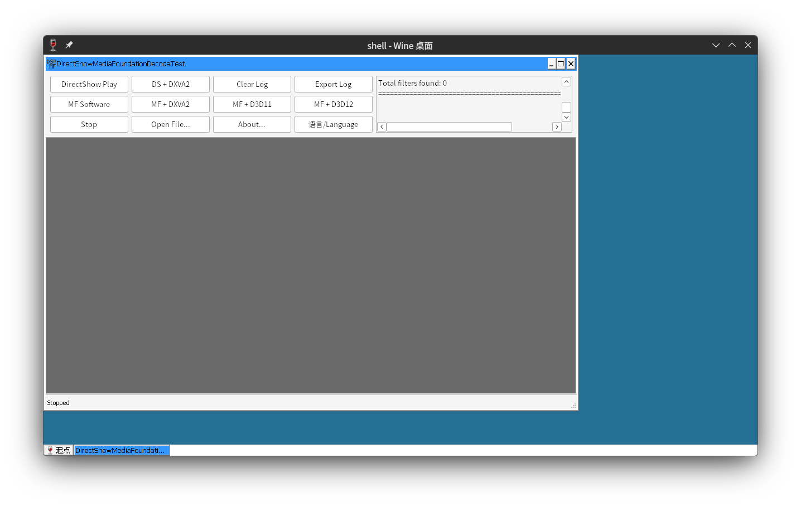
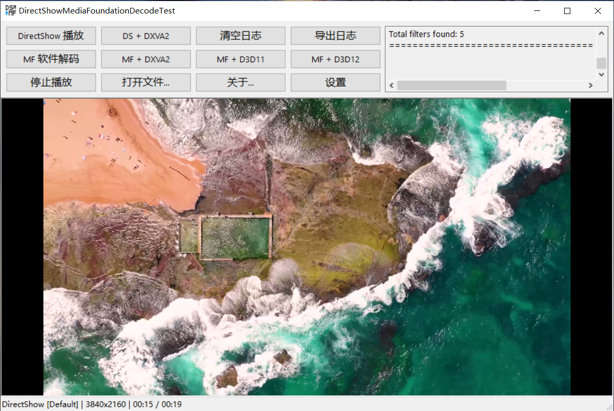
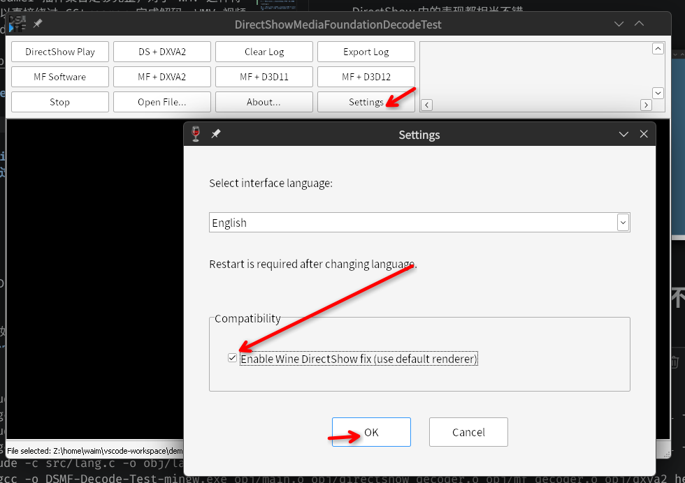
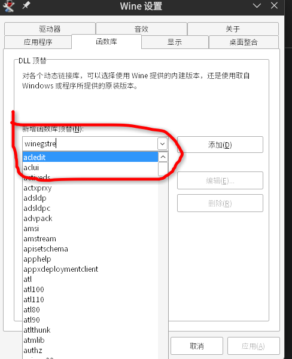
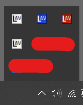

# 'DSMF-Decode-Test' is DirectShow Media Foundation Decode Test

<div align="center">
  
</div>

## 介绍

通过 Windows API 解码视频与音频。由于市面上几乎没有可用的开源项目用于测试 Windows 上 **DirectShow** 与 **Media Foundation** 的实际解码效果，因此本项目诞生了，*其中 99% 的代码通过 AI 编写*。

> 注意！此软件不能保证 100% 反映系统的实际解码效果。目前可安装的主流解码器都只能注册到 DirectShow，因此对于 MF 框架的播放效果，你可以看到相当拉胯的表现（对于不支持的格式）。解码器也不是绝对万能的。

对于 Wine，大多数视频与音频会交给 GStreamer 框架进行处理。只要你 GStreamer 插件集合足够完整，对于 WMV 这种特殊格式，Wine 可以直接绕过 GStreamer 完成解码。WMV 视频在 Wine 和 Windows DirectShow 中的表现都相当不错。





## 为什么我在wine进行DirectShow+dxva2视频只有不到四分之一的画面？



## 为什么我在 Wine 安装的第三方解码器（如 K-Lite）完全没有任何作用？通过设置 `winegstreamer.dll` 为禁用也不行？

首先，必须否定在 Wine 或模拟器社区广为流传的方法（最初在 mobox 中见过）：

```bash
WINEDLLOVERRIDE="winegstreamer=d"
```

此方法是无效的。如果你实际通过 `winecfg` 设置过，就会发现 `winegstreamer` 压根不存在于索引中，因此此方法根本没有禁用 GStreamer。



准确来讲，同样是注册的 DirectShow 解码器，在 Wine 里 GStreamer 本质上也是通过 CLSID 注册调用的，且优先级最高，直接顶掉了第三方解码器注册的 CLSID。

在 Wine 中，GStreamer 的 CLSID 注册表如下：

```registry
[HKEY_CLASSES_ROOT\CLSID\{083863F1-70DE-11D0-BD40-00A0C911CE86}\Instance\{F9D8D64E-A144-47DC-8EE0-F53498372C29}]
"CLSID"="{F9D8D64E-A144-47DC-8EE0-F53498372C29}"
"FilterData"=hex:02,00,00,00,ff,ff,5f,00,03,00,00,00,00,00,00,00,30,70,69,33,\
  00,00,00,00,00,00,00,00,01,00,00,00,00,00,00,00,00,00,00,00,30,74,79,33,00,\
  00,00,00,88,00,00,00,98,00,00,00,31,70,69,33,08,00,00,00,00,00,00,00,01,00,\
  00,00,00,00,00,00,00,00,00,00,30,74,79,33,00,00,00,00,a8,00,00,00,98,00,00,\
  00,32,70,69,33,08,00,00,00,00,00,00,00,01,00,00,00,00,00,00,00,00,00,00,00,\
  30,74,79,33,00,00,00,00,b8,00,00,00,98,00,00,00,83,eb,36,e4,4f,52,ce,11,9f,\
  53,00,20,af,0b,a7,70,00,00,00,00,00,00,00,00,00,00,00,00,00,00,00,00,61,75,\
  64,73,00,00,10,00,80,00,00,aa,00,38,9b,71,76,69,64,73,00,00,10,00,80,00,00,\
  aa,00,38,9b,71
"FriendlyName"="GStreamer splitter filter"
```

CLSID 对于大部分系统组件的值都是固定的，尽管看起来毫无逻辑。

因此禁用 GStreamer 的最好方法就是直接删除：

```
HKEY_CLASSES_ROOT\CLSID\{083863F1-70DE-11D0-BD40-00A0C911CE86}\Instance\{F9D8D64E-A144-47DC-8EE0-F53498372C29}
```

如果需要恢复 GStreamer 的调用，重新导入注册表即可。

K-lite正常生效之后，你可以在系统任务栏看到以下图标：




## CLSID

对于 DirectShow，用于注册第三方解码器的组件 ID 是固定的：

```
{083863F1-70DE-11D0-BD40-00A0C911CE86}
```

路径为：

```
HKEY_CLASSES_ROOT\CLSID\{083863F1-70DE-11D0-BD40-00A0C911CE86}\Instance\
```

因此，你可以在注册表中见到第三方解码器的注册条目，如 LAV。

MF 框架没有 CLSID 的第三方解码器注册。在 Windows 上，你只能通过微软商店的包来获取更多视频的解码支持。你可以在 [K-Lite](https://www.codecguide.com/windows_media_codecs.htm) 官网获取到一些解码支持包。

对于 Wine 的 MF 框架，如果你在 Proton Wine 中出现问题（如卡顿），可以尝试切换为原版 Wine，使用 GStreamer 进行有效解码。对于 Unity H.264，可以尝试在 Wine 编译中应用[补丁](https://github.com/Waim908/wine-patches/tree/main/mfdxgi)（*无论是否启用补丁中的变量都能解决 Unity 游戏的 H.264 视频卡死问题*）。这些补丁是通过比对原版 Proton 的 `dlls/mfplat/main.c` 生成的，通常无需移植完整的 Proton MF 源码。

MF 框架和 Linux 的 GStreamer 一样，都是多媒体相关，除了基础的视频音乐播放与解码，也涉及摄像头之类的相关多媒体功能。

## 支持的解码格式

[查看文档](supported-formats.md)

## 如何编译？

通过```ARCH```变量指定64位还是32位

```bash
make -j4 # 默认64位
make ARCH=64 -j4 # amd64
make ARCH=32 -j4 # x86
```

在linux你可以通过[msvc-wine](https://github.com/mstorsjo/msvc-wine)项目来使用cl编译

## 参考资料

- https://github.com/microsoft/media-foundation.git
- https://github.com/MicrosoftDocs/win32/tree/docs/desktop-src/DirectShow
- https://github.com/MicrosoftDocs/win32/tree/docs/desktop-src/medfound